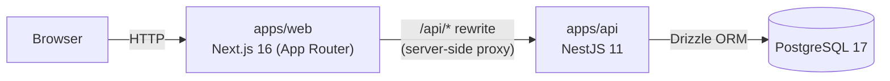
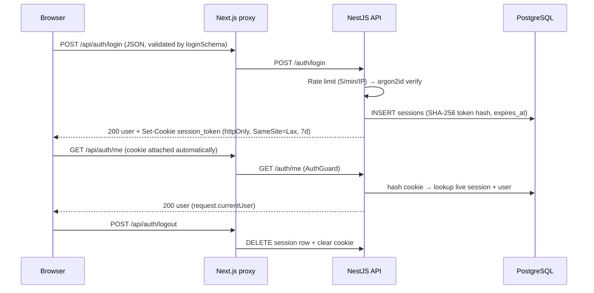

# Architecture

`danisolation-recall` is a **modular monolith** (§16): one deployable API with strong domain boundaries, a Next.js frontend, and PostgreSQL as the single source of truth. Complexity is added only when a concrete problem justifies it (§87).

---

## System overview

The browser only ever talks to the web origin. `/api/*` requests are proxied server-side to the API (`API_ORIGIN`), which means:

- no CORS configuration or preflights,
- the httpOnly session cookie is always first-party, regardless of where the API runs.

---

## Module map

### `apps/api` (NestJS)

| Path | Responsibility |
| --- | --- |
| `src/auth/` | The auth domain: controller, register/login services, session service, users repository, auth guard, rate-limit guard |
| `src/database/` | Global `DatabaseModule` — provides the Drizzle client from `DATABASE_URL` |
| `src/health/` | `GET /health` — runs `SELECT 1` |
| `src/common/` | Cross-cutting: `ZodExceptionFilter` (reshapes validation failures) |
| `src/app.module.ts` | Root module: config, validation pipe, cookie-parser middleware |

Domain modules own their controllers, services, and persistence (§28). Cross-module access goes through public entry points, never another module's internals (§29).

### `apps/web` (Next.js)

| Path | Responsibility |
| --- | --- |
| `src/app/` | Routes (App Router). Server components by default; `"use client"` only where interactivity lives |
| `src/app/login/` | Login page (server) + `LoginForm` (client): React Hook Form + `zodResolver` with the shared schema |
| `src/components/ui/` | Design-system primitives (Button, Input, FieldError) per ADR-008 |
| `src/lib/api.ts` | Thin API client: `loginUser`, typed `ApiError` with stable codes |

### `packages/`

| Package | Responsibility |
| --- | --- |
| `database` | Drizzle schema (`users`, `sessions`), `createDb()`, migrations |
| `contracts` | Zod schemas + inferred types shared by API and web (ADR-004) — single validation language |
| `eslint-config`, `typescript-config` | Shared tooling configs |

---

## Authentication flow (ADR-007)

Key properties:

- the raw token never touches the database — only its SHA-256 hash (a DB leak yields no usable credentials),
- logout revokes server-side (a DELETE), not just client-side cookie clearing,
- every authenticated request is one indexed lookup; the Redis cache layer (Phase 2) can sit in front of it without changing the domain.

---

## API surface

- Endpoint reference with request/response shapes and error codes: [`docs/api/auth.md`](docs/api/auth.md)
- Every error keeps the house shape `{ code, message }` (§54): `VALIDATION_ERROR`, `EMAIL_ALREADY_REGISTERED`, `INVALID_CREDENTIALS`, `UNAUTHENTICATED`, `RATE_LIMITED`
- External input is always validated by shared Zod schemas via `nestjs-zod` DTOs (ADR-004)

## Data model

- Schema and migration workflow: [`docs/database/schema.md`](docs/database/schema.md)
- `users` (identity) and `sessions` (live credentials) — one user has many sessions.

## Key decisions

| Decision | Recorded in |
| --- | --- |
| Drizzle ORM over Prisma | ADR-003 |
| Zod + shared contracts package + nestjs-zod | ADR-004 |
| Opaque session token in httpOnly cookie, hashed in PostgreSQL (JWT rejected — logout must revoke) | ADR-007 |
| Tailwind v4 with CSS-first tokens, product register, accessibility floor | ADR-008 |
| Next.js rewrite proxy instead of CORS — first-party session cookie, no API CORS surface | AUTH-020 task rationale + `ENVIRONMENT.md` |
| Per-IP login rate limiting, in-memory storage (Redis swap deferred) | AUTH-020A task rationale |

Deferred infrastructure (Redis, queues, worker, search engines, observability) is deliberately not present — see `docs/ROADMAP.md` and `docs/TECH-DEBT.md`.

## Testing strategy (§60)

| Level | Scope | Location |
| --- | --- | --- |
| Unit | domain logic, pure helpers | `*.spec.ts` next to the code |
| Integration | DB operations, HTTP endpoints via `supertest` (real Postgres) | `*.integration.spec.ts` |
| Component | web components via Testing Library | `apps/web/**/*.spec.tsx` |
| E2E | full journeys in a browser (planned: AUTH-021) | `apps/web/e2e/` |
