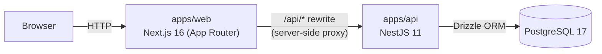
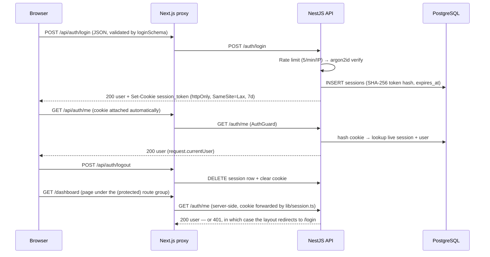

# Architecture

`danisolation-recall` is a **modular monolith** (§16): one deployable API with strong domain boundaries, a Next.js frontend, and PostgreSQL as the single source of truth. Complexity is added only when a concrete problem justifies it (§87).

---

## System overview

```mermaid
flowchart LR
    B[Browser] -- HTTP --> W["apps/web<br/>Next.js 16 (App Router)"]
    W -- "/api/* rewrite<br/>(server-side proxy)" --> A["apps/api<br/>NestJS 11"]
    A -- "Drizzle ORM" --> P[("PostgreSQL 17")]
```

The browser only ever talks to the web origin. `/api/*` requests are proxied server-side to the API (`API_ORIGIN`), which means:

- no CORS configuration or preflights,
- the httpOnly session cookie is always first-party, regardless of where the API runs.

---

## Module map

### `apps/api` (NestJS)

| Path | Responsibility |
| --- | --- |
| `src/auth/` | The auth domain: controller, register/login services, session service, users repository, auth guard, rate-limit guard |
| `src/sets/` | Study sets: `GET/POST /sets`, `GET/PATCH/DELETE /sets/:id`, with the `q` search filter (ADR-011) |
| `src/cards/` | Cards, reached only through their set: list/create, update/delete, position reorder — ownership enforced via the set (§41) |
| `src/study/` | The study loop (ADR-009): start/get sessions, record reviews (atomic review + progress upsert), finish/abandon transitions, session history, and the pure `schedule()` ladder |
| `src/progress/` | Progress reads (ADR-010): summary totals and the due queue, plus the derived daily streaks (ADR-016) |
| `src/database/` | Global `DatabaseModule` — provides the Drizzle client from `DATABASE_URL` |
| `src/health/` | `GET /health` — runs `SELECT 1` |
| `src/common/` | Cross-cutting: `ZodExceptionFilter` (reshapes validation failures) |
| `src/app.module.ts` | Root module: config, validation pipe, cookie-parser middleware |

Domain modules own their controllers, services, and persistence (§28). Cross-module access goes through public entry points, never another module's internals (§29).

### `apps/web` (Next.js)

| Path | Responsibility |
| --- | --- |
| `src/app/` | Routes (App Router). Server components by default; `"use client"` only where interactivity lives |
| `src/app/page.tsx` | Home. Reads the session server-side and shows the signed-in user + logout control, or the auth links |
| `src/app/login/`, `src/app/register/` | Auth pages (client forms: React Hook Form + `zodResolver` with the shared schemas; register signs the user in) |
| `src/app/(protected)/` | Route group whose `layout.tsx` gates access server-side (`redirect("/login")`) |
| `…/(protected)/dashboard/` | The library: sets list, search box (ADR-011's `?q=`), account panel |
| `…/(protected)/sets/[id]/` | Set detail: card management (create/edit/move/delete), the primary Study control |
| `…/(protected)/sets/new`, `…/sets/[id]/edit` | Set creation and editing forms |
| `…/(protected)/study/[sessionId]/` | The card-by-card study screen and the completion view (ADR-009's study mode) |
| `…/(protected)/progress/` | Summary, due queue, and session history (ADR-010), with the daily streak panels (ADR-016) |
| `src/components/` | `UserMenu`, `LogoutButton`, `SetList`, `CardList`, `SearchInput`, and `ui/` design-system primitives (Button, Input, FormField, FieldError) per ADR-008 |
| `src/lib/api.ts` | Browser API client (`ApiError` with stable codes): auth flows, study-session start/record/finish |
| `src/lib/session.ts`, `lib/sets.ts`, `lib/cards.ts`, `lib/tags.ts`, `lib/progress.ts` | Server-side fetchers: forward the request cookie with `cache: "no-store"`; the protected layout has already gated the request |
| `src/lib/public.ts` | Server-side fetcher for the public sharing page — sends no credentials at all (ADR-015) |

### `packages/`

| Package | Responsibility |
| --- | --- |
| `database` | Drizzle schema (nine tables), `createDb()`, migrations |
| `contracts` | Zod schemas + inferred types shared by API and web (ADR-004) — single validation language |
| `eslint-config`, `typescript-config` | Shared tooling configs |

---

## Authentication flow (ADR-007)

```mermaid
sequenceDiagram
    participant C as Browser
    participant W as Next.js proxy
    participant A as NestJS API
    participant DB as PostgreSQL

    C->>W: POST /api/auth/login (JSON, validated by loginSchema)
    W->>A: POST /auth/login
    A->>A: Rate limit (5/min/IP) → argon2id verify
    A->>DB: INSERT sessions (SHA-256 token hash, expires_at)
    A-->>C: 200 user + Set-Cookie session_token (httpOnly, SameSite=Lax, 7d)

    C->>W: GET /api/auth/me (cookie attached automatically)
    W->>A: GET /auth/me (AuthGuard)
    A->>DB: hash cookie → lookup live session + user
    A-->>C: 200 user (request.currentUser)

    C->>W: POST /api/auth/logout
    W->>A: DELETE session row + clear cookie

    C->>W: GET /dashboard (page under the (protected) route group)
    W->>A: GET /auth/me (server-side, cookie forwarded by lib/session.ts)
    A-->>W: 200 user — or 401, in which case the layout redirects to /login
```

Key properties:

- the raw token never touches the database — only its SHA-256 hash (a DB leak yields no usable credentials),
- logout revokes server-side (a DELETE), not just client-side cookie clearing,
- every authenticated request is one indexed lookup; the Redis cache layer (Phase 2) can sit in front of it without changing the domain,
- protected pages validate the session in the server component (the token hash must be looked up in PostgreSQL, so middleware cannot do it in isolation); the layout and its page share one lookup per request via React `cache()`.

---

## API surface

- Endpoint reference with request/response shapes and error codes: [`docs/api/auth.md`](docs/api/auth.md) (per-domain references for the newer modules are a documented follow-up — the route map below and the task ledger's response shapes cover them meanwhile)
- Every error keeps the house shape `{ code, message }` (§54). The register so far: `VALIDATION_ERROR`, `UNAUTHENTICATED`, `RATE_LIMITED`, `EMAIL_ALREADY_REGISTERED`, `INVALID_CREDENTIALS`, `SET_NOT_FOUND`, `CARD_NOT_FOUND`, `SESSION_NOT_FOUND`, `INVALID_STUDY_SESSION`, `REVIEW_ALREADY_RECORDED`
- External input is always validated by shared Zod schemas via `nestjs-zod` DTOs (ADR-004)
- Route map (every route below `/auth/*`, `/progress/*`, and the study/sets reads requires the session cookie):

| Route | Purpose |
| --- | --- |
| `POST /auth/register`, `POST /auth/login`, `GET /auth/me`, `POST /auth/logout` | Account and session lifecycle (login rate-limited) |
| `GET /sets`, `POST /sets` | List (`?q=` search filter, ADR-011; `?tag=` filter, ADR-012) and create sets |
| `GET/PATCH/DELETE /sets/:id` | Read, edit, delete a set (owner-only) |
| `GET/POST /sets/:id/cards` | List and create cards in study order |
| `PATCH/DELETE /sets/:id/cards/:cardId` | Edit and delete a card |
| `PATCH /sets/:id/cards/:cardId/position` | Reorder (move-to-position, CARD-008) |
| `POST /study-sessions` | Start a session — returns the session plus the set's ordered cards |
| `GET /study-sessions` | Session history, newest first (ADR-010) |
| `GET /study-sessions/:id` | One session with its reviews and cards (resume is one fetch) |
| `POST /study-sessions/:id/reviews` | Record an answer — review + progress upsert in one transaction |
| `POST /study-sessions/:id/finish`, `POST /study-sessions/:id/abandon` | Terminal transitions (finish is idempotent) |
| `GET /progress` | Summary: review counts, due count, and the two derived daily streaks (ADR-010, ADR-016) |
| `GET /progress/due` | The due queue, most-overdue first |
| `GET /health` | Liveness (`SELECT 1`) |
| `GET /public/sets/:id` | Public sharing (ADR-015) — the one unauthenticated route: whitelist payload (title, description, tags, cards), private/foreign/missing all 404 |

## Data model

- Schema and migration workflow: [`docs/database/schema.md`](docs/database/schema.md)
- Identity and access: `users` ← `sessions` (one user, many live sessions; only the token hash is stored)
- Content: `study_sets` ← `cards` (position-ordered, reached only through their set)
- Learning: `study_sessions` (an interaction over one set, `ACTIVE → COMPLETED/ABANDONED` per ADR-009) ← `reviews` (append-only answer history), plus `user_card_progress` (one row per user+card: counts, streak, `next_review_at` — the ladder's scheduling state)
- Streaks are **derived, not stored** (ADR-016): the daily streak is a pure function over the distinct UTC review days in `reviews`, so no table, column, or migration backs it — the only state it could drift from is the history it is computed from. "Daily streak" (days practiced) is a different fact from `user_card_progress.streak` (one card's consecutive correct answers)
- Deletes cascade from the user all the way down; deleting a set takes its cards, sessions, reviews, and progress with it (ADR-009's recorded tradeoff)

## Key decisions

| Decision | Recorded in |
| --- | --- |
| Drizzle ORM over Prisma | ADR-003 |
| Zod + shared contracts package + nestjs-zod | ADR-004 |
| Opaque session token in httpOnly cookie, hashed in PostgreSQL (JWT rejected — logout must revoke) | ADR-007 |
| Tailwind v4 with CSS-first tokens, product register, accessibility floor — **visuals superseded by ADR-018; the a11y floor and token-first discipline stand** | ADR-008 |
| Study sessions: `ACTIVE → COMPLETED/ABANDONED` state machine, binary reviews, isolated Leitner ladder scheduler | ADR-009 |
| Progress: dedicated `/progress` page, due = `next_review_at <= now`, counts-only API (accuracy derived client-side) | ADR-010 |
| Search: `q` filter on `GET /sets` (collection filtering), `ILIKE` substring on title/description, no index at MVP scale | ADR-011 |
| Organization: tags (many-to-many, case-insensitive per-user names), replace-style `PUT /sets/:id/tags`, `?tag=` filter composing with `q` | ADR-012 |
| UI polish: ADR-008 deepened — `lucide-react` icons (always beside labels), centralized panel/link registers, CSS-only transform/opacity motion, copy/roles frozen for the test suite — **visuals superseded by ADR-018; the icon rule, centralization, motion policy, and frozen-copy invariant are retained** | ADR-013 |
| Folders: single-parent containment (`folders` + `study_sets.folder_id`, `ON DELETE SET NULL`), per-user case-insensitive names, counts on `GET /folders`, `?folder=` composing with `q` and `tag` — **removed by ADR-017** | ADR-014 |
| Sharing: `visibility` token on `study_sets` rides the update path only (sets start private), whitelist public payload (no owner id or token), unauthenticated `GET /public/sets/:id` + read-only `/share/sets/[id]` page, private/foreign/missing indistinguishable | ADR-015 |
| Removing folders entirely — delete, not deprecate; tags + search remain the organization story | ADR-017 |
| Daily streaks derived from the review history by a pure function, never persisted — no table, no migration, no write on the hot review path; rides `GET /progress` | ADR-016 |
| Whole-app rebrand to the claymorphism identity (ADR-018): pastel violet/green surfaces, 16–24px radii, 3–4px borders, inner+outer double shadows, Baloo 2 / Comic Neue. Token-first, page-later, and contrast-verified rather than trusted. **Supersedes ADR-008/ADR-013 visually; accessibility outcomes retained.** Dark mode is explicitly out of scope; typography is a recorded accepted regression | ADR-018 |
| Next.js rewrite proxy instead of CORS — first-party session cookie, no API CORS surface | AUTH-020 task rationale + `ENVIRONMENT.md` |
| Per-IP login rate limiting, in-memory storage (Redis swap deferred) | AUTH-020A task rationale |

Deferred infrastructure (Redis, queues, worker, search engines, observability) is deliberately not present — see `docs/ROADMAP.md` and `docs/TECH-DEBT.md`.

## Testing strategy (§60)

| Level | Scope | Location |
| --- | --- | --- |
| Unit | domain logic, pure helpers | `*.spec.ts` next to the code |
| Integration | DB operations, HTTP endpoints via `supertest` (real Postgres) | `*.integration.spec.ts` |
| Component | web components via Testing Library | `apps/web/**/*.spec.tsx` |
| E2E | full journeys in a browser against the real stack (Playwright) | `apps/web/e2e/` |
