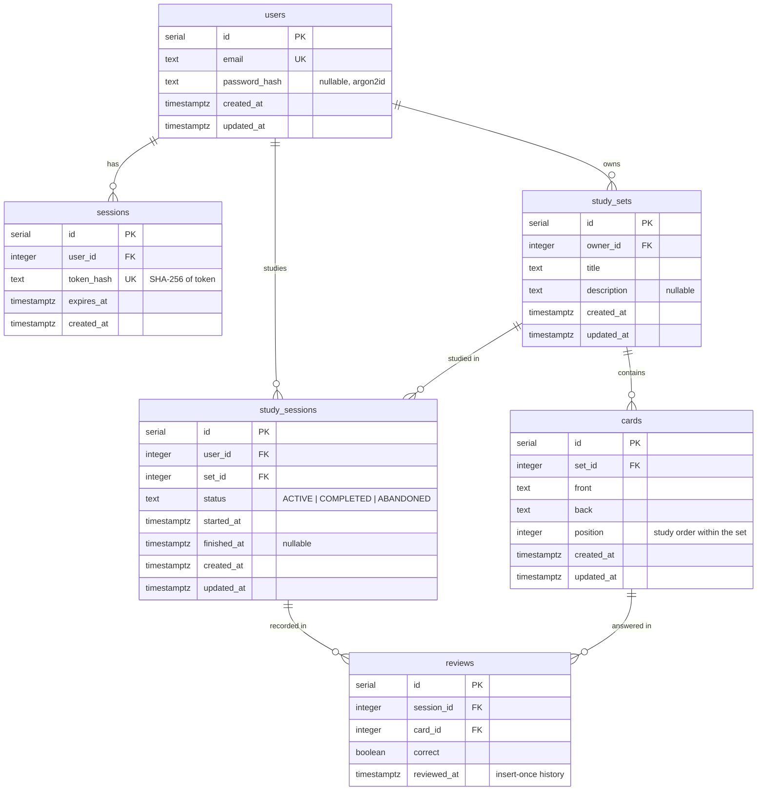

# Database schema

PostgreSQL 17, accessed through Drizzle ORM (ADR-003). Schema lives in `packages/database/src/schema.ts`; migrations in `packages/database/drizzle/`. PostgreSQL is the single source of truth; relational invariants are enforced in the schema, not just application code (§32).

---

## Tables

### users

| Column | Type | Constraints |
| --- | --- | --- |
| `id` | serial | primary key |
| `email` | text | not null, unique |
| `password_hash` | text | nullable (argon2id hash; never plaintext, §42) |
| `created_at` | timestamp with time zone | not null, default `now()` |
| `updated_at` | timestamp with time zone | not null, default `now()` |

One row per user identity. Migrations: `0000_strange_master_mold.sql`, `0001_acoustic_black_widow.sql`.

### sessions

| Column | Type | Constraints |
| --- | --- | --- |
| `id` | serial | primary key |
| `user_id` | integer | not null, FK → `users.id` **ON DELETE CASCADE** |
| `token_hash` | text | not null, **unique** — SHA-256 of the session token; the raw token is never stored (ADR-007) |
| `expires_at` | timestamp with time zone | not null |
| `created_at` | timestamp with time zone | not null, default `now()` |

One row per live session; a user may have several (multiple devices). Deleting a user removes their sessions via the cascade. Session validation looks up `token_hash` with `expires_at > now()`. Migration: `0002_stiff_xavin.sql`.

### study_sets

| Column | Type | Constraints |
| --- | --- | --- |
| `id` | serial | primary key |
| `owner_id` | integer | not null, FK → `users.id` **ON DELETE CASCADE** |
| `title` | text | not null |
| `description` | text | nullable |
| `created_at` | timestamp with time zone | not null, default `now()` |
| `updated_at` | timestamp with time zone | not null, default `now()` |

One row per study set; every set belongs to exactly one owner. Deleting a user removes their sets via the cascade. Owner-scoped queries use `study_sets_owner_id_index`. Migration: `0003_lazy_oracle.sql`.

### cards

| Column | Type | Constraints |
| --- | --- | --- |
| `id` | serial | primary key |
| `set_id` | integer | not null, FK → `study_sets.id` **ON DELETE CASCADE** |
| `front` | text | not null |
| `back` | text | not null |
| `position` | integer | not null — the card's place in the set's study order |
| `created_at` | timestamp with time zone | not null, default `now()` |
| `updated_at` | timestamp with time zone | not null, default `now()` |

One row per card; every card belongs to exactly one set, and deleting a set removes its cards via the cascade (SET-008). Set-scoped queries use `cards_set_id_index`. `position` is deliberately **not** unique-constrained: reordering shifts several rows at once, which a unique index would reject mid-transaction — ordering integrity is owned by the cards repository, the only writer (CARD-001). Migration: `0004_marvelous_makkari.sql`.

### study_sessions

| Column | Type | Constraints |
| --- | --- | --- |
| `id` | serial | primary key |
| `user_id` | integer | not null, FK → `users.id` **ON DELETE CASCADE** |
| `set_id` | integer | not null, FK → `study_sets.id` **ON DELETE CASCADE** |
| `status` | text | not null — `ACTIVE`, `COMPLETED`, or `ABANDONED` (ADR-009) |
| `started_at` | timestamp with time zone | not null, default `now()` |
| `finished_at` | timestamp with time zone | nullable, set on the terminal transitions |
| `created_at` | timestamp with time zone | not null, default `now()` |
| `updated_at` | timestamp with time zone | not null, default `now()` |

One row per study session — an ordered pass over one of the user's sets (ADR-009). The session's state machine (`ACTIVE → COMPLETED | ABANDONED`) is owned by the study repository, the only writer, so `status` is plain text like `cards.position` is a plain integer; deleting a user or a set removes its sessions via the cascade. History queries use `study_sessions_user_id_index`. Migration: `0005_material_gamma_corps.sql`.

### reviews

| Column | Type | Constraints |
| --- | --- | --- |
| `id` | serial | primary key |
| `session_id` | integer | not null, FK → `study_sessions.id` **ON DELETE CASCADE** |
| `card_id` | integer | not null, FK → `cards.id` **ON DELETE CASCADE** |
| `correct` | boolean | not null — ADR-009's binary answer model |
| `reviewed_at` | timestamp with time zone | not null, default `now()` |

One row per answered card — a historical event that is inserted once and never updated (§44, §46); `reviewed_at` doubles as the row's creation timestamp for exactly that reason. `reviews_session_id_card_id_unique` makes ADR-009's one-review-per-card-per-session rule race-proof at the database level; the study repository translates a violation into 409 `REVIEW_ALREADY_RECORDED`. Session history uses `reviews_session_id_index`; `reviews_card_id_index` serves the Progress phase's per-card joins (and cascade deletes). Migration: `0006_large_klaw.sql`.



---

## Migration workflow

```bash
# 1. edit packages/database/src/schema.ts
pnpm --filter @danisolation-recall/database db:generate   # creates drizzle/000N_*.sql
pnpm --filter @danisolation-recall/database db:migrate    # applies pending migrations
```

Rules:

- every schema change requires a generated migration (§32); never edit applied migration files
- `drizzle-kit` falls back to the local default connection string, so no `.env` is needed for migrations
- after schema edits, **rebuild the package** (`pnpm --filter @danisolation-recall/database build`) before running filtered test suites — apps consume the compiled `dist/` (see CONTRIBUTING gotchas)
- timestamps are always `with time zone` and stored UTC (§49)
